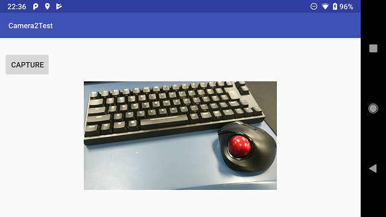

Camera2Test
====

パーミッションを確認する場合の実行順序メモ
----
今回はとりあえずonResume()で次の3状態を判断することにした。

  - 1. パーミッション確認ダイアログでユーザが拒否した場合
    - → アプリ情報からカメラ権限を許可するようにうながすToastを表示
  - 2. permissionが未確認の状態
    - → パーミッション確認ダイアログを表示
  - 3. パーミッション確認ダイアログでユーザが許可した場合
    - → カメラプレビューを起動

パーミッション確認ダイアログを表示する際、アプリのActivityは裏に回ってonPause()が呼び出されるので要注意…

### 1. Permission確認済みの場合 (許可されている場合)
  - onCreate()
  - onResume()
    - 許可済みなので、プレビューを起動する
  - ...
  - onPause()
    - プレビューを停止する

### 2. Permission確認済みの場合 (拒否されている場合)  
  - onCreate()
  - onResume()
    - 拒否済みなので、設定から許可してくださいとの趣旨を表示する
  - ...
  - onPause()
    - プレビューを起動していないのでなにもしない

### 3. はじめてPermissionを確認する場合 (許可した場合)
  - onCreate()
  - onResume()
    - 許可/拒否未確認状態。まだプレビューを起動してはいけない
    - パーミッションダイアログを開く処理を実行
  - onPause()
    - カレントのActivityが一度パーミッションダイアログへ移る
  - (ここでパーミッションダイアログが開く。許可の操作を行う)
  - onRequestPermissionsResult()
    - カレントのActivityがダイアログから戻ってくる
    - 許可された結果を受け取る
  - onResume()
    - 許可済みなので、プレビューを起動する
  - ...
  - onPause()
    - プレビューを停止する

### 4. はじめてPermissionを確認する場合 (拒否した場合)
  - onCreate()
  - onResume()
    - 許可/拒否未確認状態。まだプレビューを起動してはいけない
    - パーミッションダイアログを開く処理を実行
  - onPause()
    - カレントのActivityが一度パーミッションダイアログへ移る
  - (ここでパーミッションダイアログが開く。許可の操作を行う)
  - onRequestPermissionsResult()
    - カレントのActivityがダイアログから戻ってくる
    - 拒否された結果を受け取る
  - onResume()
    - 拒否済みなので、設定から許可してくださいとの趣旨を表示する
  - ...
  - onPause()
    - プレビューを起動していないのでなにもしない

Copyright and license
----
Copyright (c) 2018 yoggy

Released under the [MIT license](LICENSE.txt)